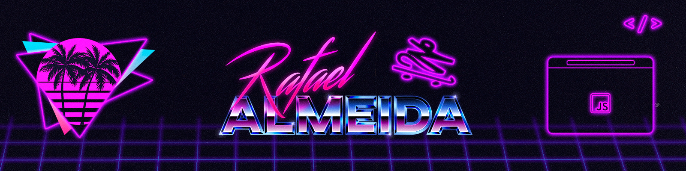

<!-- Bem vindo + Banner -->

    

</img>

#

<!-- Minha descrição -->

    Me chamo <strong>Rafael Almeida</strong> e atualmente estou cursando Ciência da Computação no Centro Universitário de João Pessoa - UNIPÊ. Em busca de aprimorar meus conhecimentos na área de tecnlogia e com foco em trabalhar com Front-End.

#

<!-- Contatos e Stack -->

<h3 align="left">Connect with me!</h3>

[![LinkedIn](https://img.shields.io/badge/-LinkedIn-000?style=for-the-badge&logo=data:image/svg+xml;base64,PHN2ZyB4bWxucz0iaHR0cDovL3d3dy53My5vcmcvMjAwMC9zdmciIHdpZHRoPSIyMDAiIGhlaWdodD0iMjAwIiB2aWV3Qm94PSIwIDAgMTQgMTQiPgogIDxwYXRoIGZpbGw9IiM1NTAwZjAiIGQ9Ik0zLjU3NCAxLjc2N2ExLjMxNiAxLjMxNiAwIDAgMS0xLjI4NyAxLjMyNkExLjM0NiAxLjM0NiAwIDAgMSAuOTkgMS43NjdBMS4zMjYgMS4zMjYgMCAwIDEgMi4yODcuNWExLjMxNiAxLjMxNiAwIDAgMSAxLjI4NyAxLjI2N00xLjEyOSA1LjQ0OWMwLS43NjIuNDg1LS42NDMgMS4xNTgtLjY0M2MuNjczIDAgMS4xNDgtLjExOSAxLjE0OC42NDN2Ny40MjRjMCAuNzcyLS40ODUuNjE0LTEuMTQ4LjYxNGMtLjY2MyAwLTEuMTU4LjE1OC0xLjE1OC0uNjE0em00LjMwNi4wMDFjMC0uNDI2LjE1OC0uNTg1LjQwNS0uNjM0Yy4yNDgtLjA1IDEuMDk5IDAgMS4zOTYgMGMuMjk3IDAgLjQxNi40ODUuNDA2Ljg1MWEyLjQ4NSAyLjQ4NSAwIDAgMSAyLjIxNy0uOTlhMi45NyAyLjk3IDAgMCAxIDMuMTQ4IDMuMDk4djUuMDY4YzAgLjc3Mi0uNDc1LjYxNC0xLjE0OS42MTRjLS42NzMgMC0xLjE0OC4xNTgtMS4xNDgtLjYxNFY4Ljg4NEExLjQyNSAxLjQyNSAwIDAgMCA5LjIwNiA3LjM0QTEuNDM1IDEuNDM1IDAgMCAwIDcuNzQgOC45MTR2My45NTljMCAuNzcyLS40ODUuNjE0LTEuMTU4LjYxNGMtLjY3MyAwLTEuMTQ4LjE1OC0xLjE0OC0uNjE0VjUuNDQ5WiIvPgo8L3N2Zz4=)](https://www.linkedin.com/in/rrafaelqa/)

<h3 align="left">My Stack ~</h3>

  
  
  
  
  

 

#

<!-- Estatísticas -->

  <h3>* GitHub Stats *</h3>
   
  

  
  

#

<!-- Jogo da Cobrinha -->
<picture>
  <source media="(prefers-color-scheme: dark)" srcset="https://raw.githubusercontent.com/rrafaum/rrafaum/output/github-snake-dark.svg" />
  <source media="(prefers-color-scheme: light)" srcset="https://raw.githubusercontent.com/rrafaum/rrafaum/output/github-snake.svg" />
  
</picture>